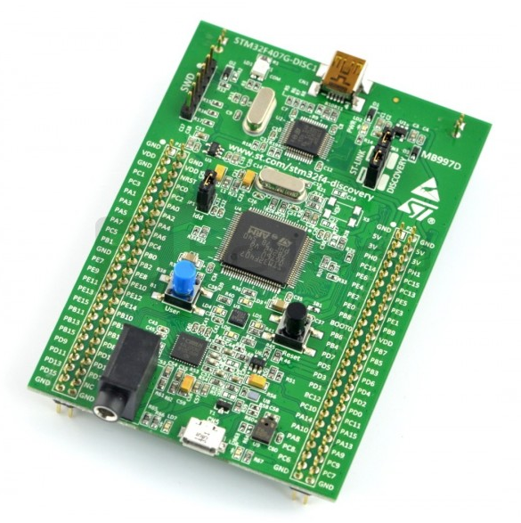

# STM32F407VG-DISCOVERY

## System overview

* **Core**: Arm Cortex-M4F (F - Floating point unit)
* **Architecture**: 32-bit
* **Flash**: 1 MB
* **SRAM**: 192+4 KB
* **Vcc**: 1.8 V - 3.6 V
* **System clock**: 16 MHz internal RC or 8 MHz (onboard) crystal oscillator

## Peripherals overview

* **ADC**: 3 x 12-bit A/D converters
* **DAC**: 2 x 12-bit D/A converters
* **Timers**: 12 x 16-bit, 2 x 32-bit
* **I2C**: 3x
* **SPI**: 3x
* **USART/UART**: 4x
* **CAN**: 2x

